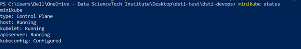
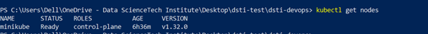
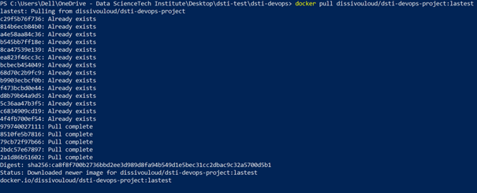
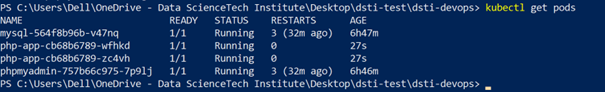
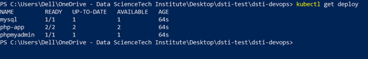
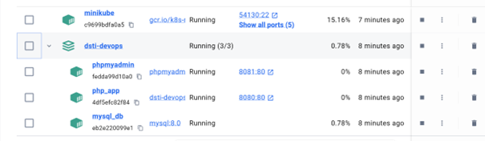
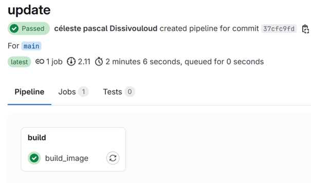
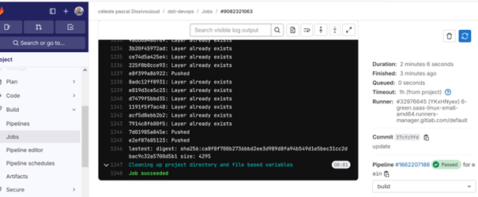
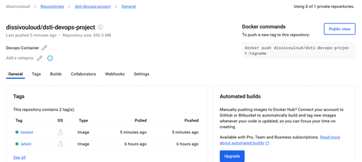

# DevOps Project: Engineer Registration Web Application

##  **Introduction**

This project is designed to create a web application for engineers to register for IT engineering projects, showcasing the integration of DevOps methodologies with application development. The primary focus is on building the app with automation, scalability, and reliability, using tools and practices such as CI/CD, Docker, Kubernetes, and monitoring.

- **Backend**: PHP
- **Frontend**: HTML, CSS, jQuery, Axios
- **Database**: MySQL

### **DevOps Key Highlights**:
1. **CI/CD Pipelines**: Automate the testing, building, and deployment of code with GitLab CI/CD.
2. **Infrastructure as Code (IaC)**: Provision environments with Vagrant and Ansible.
3. **Containerization**: Docker containers for portable and reproducible setups.
4. **Container Orchestration**: Manage containers using Kubernetes.
5. **Monitoring**: Implement monitoring with Prometheus and Grafana for observability.

---

##  **Features and Technologies**

- **CI/CD Pipeline** powered by GitLab CI/CD.
- **Docker** for containerization and orchestration via **Docker Compose**.
- **Kubernetes** for managing containers and scaling.
- **MySQL** with automated database migrations and populated tables.
- **phpMyAdmin** for MySQL database management.
- **Postman** for testing and documenting the CRUD API.

---

##  **Project Setup and Deployment**

### **1. Clone the Repository**

Clone the repository to your local machine:

```bash
git clone git@gitlab.com:dissivouloudp/dsti-devops.git
cd dsti-devops
```

### **2. Requirements**

Ensure you have the following installed:
- **Docker**: for containerization and running the app locally.
- **Docker Compose**: for multi-container applications.
- **Kubernetes (Minikube)**: for local cluster management.
- **kubectl**: Kubernetes CLI tool.

### **3. Deploying Locally with Docker**

1. **Run Docker Compose**:

   Run the following command to build and start the containers:

   ```bash
   docker-compose up --build
   ```

   This will:
   - Build Docker images.
   - Start the application and database containers.
   - Automatically run database migrations and populate tables for testing.

2. **Access the Application**:
   Open your browser and navigate to:

   ```
   http://localhost
   ```

   The application should be up and running locally.

### **4. Kubernetes Deployment**

1. **Create Kubernetes Resources**:

   Apply the following deployment files:

   ```bash
   kubectl apply -f mysql-deployment.yaml
   kubectl apply -f php-app-deployment.yaml
   kubectl apply -f phpmyadmin-deployment.yaml
   ```

2. **Expose Services**:

   Kubernetes exposes services on **NodePort**. Check the services and access them via the respective ports:

   ```bash
   kubectl get services
   ```












   Access:
   - **PHP App**: `http://<K8s_IP>:<NodePort>`
   - **phpMyAdmin**: `http://<K8s_IP>:<NodePort>`

---

##  **Configuration Files**

### **1. Docker and Docker Compose**


The `docker-compose.yml` file defines the necessary services for the web application and database. It also automates the database migrations and populates the tables during startup.

### **2. Kubernetes YAML Files**

The project includes several Kubernetes resources for deploying the application:

- **mysql-deployment.yaml** – Defines the MySQL deployment and persistent storage.
- **php-app-deployment.yaml** – Defines the PHP application deployment.
- **phpmyadmin-deployment.yaml** – Deploys phpMyAdmin for managing the MySQL database.
- **mysql-pv.yaml** – Configures persistent volumes for MySQL data storage.

### **3. CI/CD Pipeline with GitLab CI**

The **GitLab CI/CD pipeline** automates the build and deployment process. Here's a breakdown of the pipeline stages and setup:

#### **CI Pipeline Stages**:
- **Build Stage**: Build the Docker image and push it to Docker Hub.
- **Deploy Stage** (commented out in the configuration): Deploy the Docker container to a server.

#### **GitLab CI/CD Configuration**:
The `.gitlab-ci.yml` file is used to automate the Docker image build and deployment. The pipeline is divided into the following stages:

1. **Build Image**:
   - The image is built using Docker and pushed to **Docker Hub**. The pipeline authenticates to Docker Hub using the credentials stored as environment variables (`REGISTRY_USER` and `REGISTRY_PASS`).
   
2. **Deploy** (optional):
   - Deploy the Docker image to a remote server (SSH access required) and run the application using Docker.

   

   

   This is the picture in Docker Hub after automation and the update of the image

   
---

##  **API Testing with Postman**

This project uses **Postman** to test and document the CRUD API. Postman allows you to interact with the API endpoints and test their functionality.

### **Steps for API Testing**:

1. **Download Postman**: 
   - If you don’t have Postman installed, download it from [Postman](https://www.postman.com/downloads/).

2. **Import the Collection**:
   - Use the provided Postman collection to interact with the CRUD API. The collection includes requests for creating, reading, updating, and deleting engineers.

3. **Test the API**:
   
   - Use the collection to test the different API endpoints, including:
     - **Create Engineer**: `POST /api/engineers`
     - **Get All Engineers**: `GET /api/engineers`
     - **Update Engineer**: `POST /api/engineers/{id}`
     - **Delete Engineer**: `POST /api/engineers/{id}`

---

##  **Monitoring and Observability**

1. **Prometheus and Grafana**:
   - Prometheus is used for monitoring the health of the application.
   - Grafana is connected to Prometheus to visualize application metrics such as CPU usage, memory usage, and more.

2. **Alerting**:
   - Alerts are configured in Prometheus and Grafana to notify you when the application or any microservices are experiencing issues.

---

##  **Author**

- **Pascal DISSIVOULOUD**
- **Abdoul BA**

---

##  **Conclusion**

This project demonstrates a modern DevOps pipeline from development to deployment, using industry-standard tools and practices such as Docker, Kubernetes, CI/CD, and monitoring. It provides a solid foundation for scaling web applications and maintaining high reliability through automated pipelines and observability.

---

### **Additional Notes**:
- **Database and Migrations**: Handled automatically through Docker Compose and Kubernetes on deployment.
- **Testing**: Continuous testing with GitLab CI ensures that the app remains stable and functional with each change.

