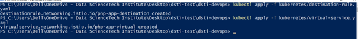

# **DevOps Project: Engineer Registration Web Application**

## **Introduction**

This project aims to develop a web application that allows engineers to register for IT engineering projects while integrating DevOps methodologies. The focus is on automation, scalability, and reliability, leveraging tools and best practices such as CI/CD, Docker, Kubernetes, and monitoring.

### **Technology Stack**
- **Backend**: PHP
- **Frontend**: HTML, CSS, jQuery, Axios
- **Database**: MySQL

### **DevOps Key Features**
1. **CI/CD Pipelines**: Automated testing, building, and deployment using GitLab CI/CD.
2. **Infrastructure as Code (IaC)**: Environment provisioning using Vagrant and Ansible.
3. **Containerization**: Utilizing Docker for portability and consistency.
4. **Container Orchestration**: Managing and scaling containers with Kubernetes.
5. **Monitoring and Observability**: Implementing Prometheus and Grafana for system insights.

---

## **Features and Technologies**

- **CI/CD Pipeline** powered by GitLab CI/CD for automated workflows.
- **Docker** for containerization, using **Docker Compose** for multi-container management.
- **Kubernetes** for orchestrating and scaling containerized services.
- **MySQL** with automated database migrations and pre-populated tables.
- **phpMyAdmin** for simplified MySQL database management.
- **Postman** for API testing and documentation.

---

## **Project Setup and Deployment**

### **1. Cloning the Repository**

Clone the repository to your local machine:
```bash
git clone git@gitlab.com:dissivouloudp/dsti-devops.git
cd dsti-devops
```

### **2. System Requirements**
Ensure the following tools are installed:
- **Docker** for containerization.
- **Docker Compose** for managing multi-container applications.
- **Kubernetes (Minikube)** for running a local Kubernetes cluster.
- **kubectl** for Kubernetes command-line operations.

### **3. Deploying Locally with Docker**

1. **Start Docker Compose**:
   ```bash
   docker-compose up --build
   ```
   - Builds Docker images.
   - Starts application and database containers.
   - Runs database migrations and populates tables.

2. **Access the Application**:
   - Open a browser and go to:
     ```
     http://localhost
     ```

### **4. Deploying with Kubernetes**

1. **Apply Kubernetes Configurations**:
   ```bash
   kubectl apply -f mysql-deployment.yaml
   kubectl apply -f php-app-deployment.yaml
   kubectl apply -f phpmyadmin-deployment.yaml
   ```

2. **Expose Kubernetes Services**:
   ```bash
   kubectl get services
   ```
   - Access the application and phpMyAdmin using the displayed NodePort.

---

## **Configuration Files**

### **1. Docker and Docker Compose**
Defines services, environment variables, and automated setup for MySQL and the PHP application.

### **2. Kubernetes Deployment Files**
- **mysql-deployment.yaml**: Defines MySQL deployment with persistent storage.
- **php-app-deployment.yaml**: Deploys the PHP application.
- **phpmyadmin-deployment.yaml**: Sets up phpMyAdmin for database management.
- **mysql-pv.yaml**: Configures persistent volumes for MySQL data.

### **3. CI/CD Pipeline Configuration (GitLab CI/CD)**
The `.gitlab-ci.yml` file automates build and deployment stages:

#### **Pipeline Stages**:
1. **Build**: Builds Docker images and pushes them to Docker Hub.
2. **Deploy**: Deploys images to a remote server (optional).

Example Docker image: `dissivouloud/dsti-devops-project:latest`

---

## **Infrastructure as Code (IaC) with Vagrant**

1. **Initialize Vagrant**:
   ```bash
   vagrant up
   ```
2. **Provision the Environment**:
   ```bash
   vagrant provision
   ```
3. **Access the Virtual Machine**:
   ```bash
   vagrant ssh
   ```


---

## **API Testing with Postman**

This project uses **Postman** for testing CRUD operations.

### **API Testing Steps**:
1. **Download Postman**: [Postman Download](https://www.postman.com/downloads/)
2. **Import API Collection**: Load the provided collection for testing endpoints.
3. **Perform CRUD operations**: Create, read, update, and delete engineer records.


---

## **Monitoring and Observability**

1. **Prometheus and Grafana**:
   - **Prometheus** collects application metrics.
   - **Grafana** visualizes CPU usage, memory usage, and system health.





2. **Alerts and Notifications**:
   - Configured alerts in Prometheus and Grafana notify of potential issues.

---

## **Authors**

- **Pascal DISSIVOULOUD**
- **Abdoul BA**

---

## **Conclusion**

This project showcases a complete DevOps pipeline from development to deployment using industry-standard tools such as Docker, Kubernetes, CI/CD, and monitoring solutions. It provides a scalable and automated solution for managing web applications efficiently.

---

### **Application Running Locally**


### **Additional Notes**:
- **Database and Migrations**: Automatically handled through Docker Compose and Kubernetes.
- **Testing**: Continuous integration with GitLab CI/CD ensures stability.

